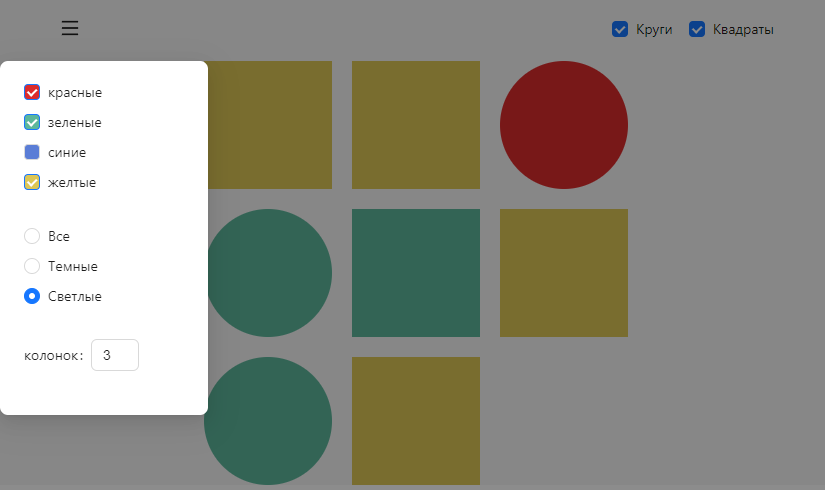

# Тестовое задание 
### Круги и квадраты


Ссылка на задание: https://github.com/mSnus/test-task

### Стек
* Архитектура - Feature-Sliced Design
* Фреймворк - React
* Менеджер состояния - Redux Tool Kit
* Маршрутизация - React Router v.6
* UI KIT - Ant Design

Примечание. В данном приложении маршрутизация - избыточный функционал.  
Сделана только потому, что в больших приложениях она обязательна.

### Установка 
```shell
$ yarn
```

### Запуск в режиме разработки
```shell
yarn start
```
